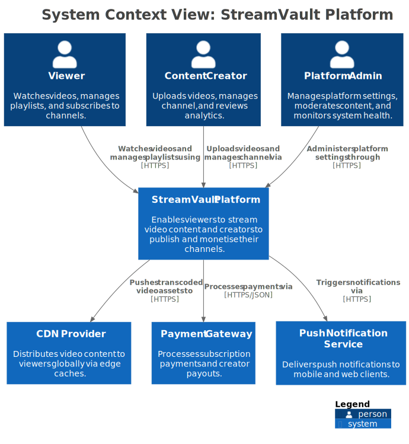
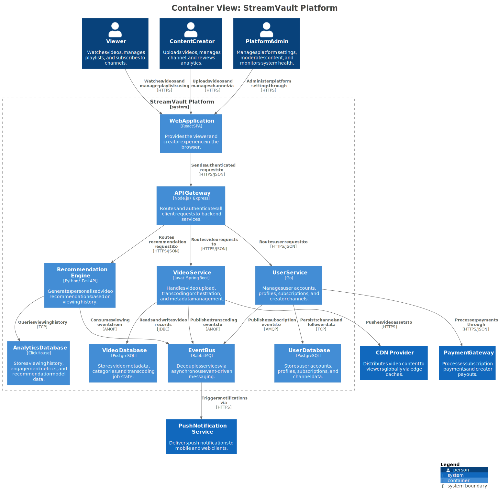

# c4-architecture

A Claude Code plugin that analyses codebases and produces C4 architecture models in Structurizr DSL.

> **Disclaimer:** This project is not affiliated with, endorsed by, or associated with
> [Structurizr](https://structurizr.com) or [Simon Brown](https://simonbrown.je).
> It uses the open-source [Structurizr CLI](https://github.com/structurizr/cli)
> and [Structurizr DSL](https://docs.structurizr.com/dsl).
> "Structurizr" is a trademark of Structurizr Limited.

## Features

- **Architecture discovery** — reads build files, source code, and config to map out actors, services, data stores, and how they connect
- **Full C4 depth** — models all 3 useful levels: System Context, Container, and Component (Level 4 Code is what the IDE shows)
- **Single-file DSL output** — produces one `workspace.dsl` capturing the entire architecture in a diffable, version-controlled format
- **DSL-first, AI-agent-friendly** — no visual-only styling; every line carries architectural meaning that agents can read, reason about, and maintain
- **Optional image rendering** — SVG diagrams via `structurizr-cli` + `plantuml`, with clickable drill-down links between views

## Project Layout

The DSL file lives in your project, versioned alongside code. When architecture changes with code, reviewers see the impact in the DSL diff.

```
project-root/
├── architecture/
│   ├── workspace.dsl          # Committed — the architecture source of truth
│   └── .diagrams/             # Gitignored — rendered SVG output
├── src/
├── ...
```

## Prerequisites

**Optional (for validation and rendering):**

- `brew install structurizr-cli` — validates DSL syntax and exports to PlantUML format
- `brew install plantuml` — renders exported PlantUML files to PNG or SVG images

Neither tool is required. The skill generates a valid `workspace.dsl` file that is fully usable without any additional tooling.

> **Note:** The standalone Structurizr CLI is being consolidated into
> [Structurizr vNext](https://github.com/structurizr/structurizr) (v6.0.0, Apache-2.0 licence).
> The `export` and `validate` commands remain free and open source.

## Usage

Run `/c4` inside Claude Code. The skill reads the current project and produces a C4 architecture model.

**Primary output:** `architecture/workspace.dsl` — committed to the repository as the architecture source of truth.

**Optional rendered images:** `architecture/.diagrams/` — gitignored SVG files for documentation or presentations.

To manually render images after generation, use the bundled render script:

```bash
# Render SVGs with drill-down links (clicking a system → containers, clicking a container → components)
scripts/render.sh architecture/workspace.dsl architecture/.diagrams
```

## Example Output

These diagrams were generated from the [example workspace](skills/c4-architecture/examples/example-workspace.dsl) — a video streaming platform. The SVGs are clickable: clicking a system drills into its containers, clicking a container drills into its components.

### System Context

Who uses the system and what external dependencies does it have?



### Containers

What are the deployable units inside the system?



### Components

What are the logical building blocks inside each container?

| Container | View |
|-----------|------|
| API Gateway | [ComponentsOfApiGateway.svg](skills/c4-architecture/examples/.diagrams/ComponentsOfApiGateway.svg) |
| Video Service | [ComponentsOfVideoService.svg](skills/c4-architecture/examples/.diagrams/ComponentsOfVideoService.svg) |
| User Service | [ComponentsOfUserService.svg](skills/c4-architecture/examples/.diagrams/ComponentsOfUserService.svg) |
| Recommendation Engine | [ComponentsOfRecommendationEngine.svg](skills/c4-architecture/examples/.diagrams/ComponentsOfRecommendationEngine.svg) |

## C4 Levels

| Level | View | What it shows |
|-------|------|---------------|
| 1 — System Context | `systemContext` | The system, its actors (people), and external system dependencies |
| 2 — Container | `container` | The internal deployable units: services, databases, message queues, frontends |
| 3 — Component | `component` (one per container) | Logical groupings within a container: handlers, services, repositories, clients, middleware |
| Optional — Deployment | `deployment` | Infrastructure and deployment environments |
| Optional — Dynamic | `dynamic` | Key behavioural flows showing runtime interactions |

## Plugin Structure

```
c4-architecture/
├── .claude-plugin/
│   └── plugin.json
├── commands/
│   └── c4.md
├── scripts/
│   └── render.sh
├── skills/
│   └── c4-architecture/
│       ├── SKILL.md
│       ├── references/
│       │   ├── structurizr-dsl-reference.md
│       │   └── structurizr-dsl-advanced.md
│       └── examples/
│           ├── example-workspace.dsl
│           └── .diagrams/              # Rendered example SVGs
└── README.md
```

## Acknowledgements

Inspired by [bitsmuggler/c4-skill](https://github.com/bitsmuggler/c4-skill) by Patrick Roos.
